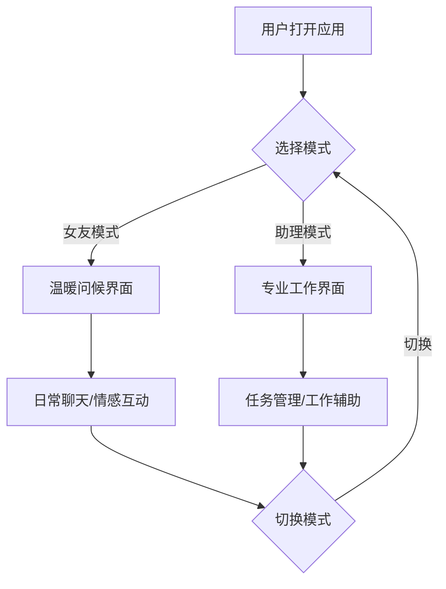

# AI智能伴侣 - 产品需求文档

## 1. 产品概述

一款具有双人格模式的AI智能伴侣应用，用户可以在"专业助理"和"温柔女友"两种模式间自由切换，在工作场景提供高效辅助，在日常生活中给予情感陪伴和温暖互动。

**核心价值：**
- 满足职场人士的多重角色需求
- 提供有温度的AI交互体验
- 打造独特的情感化AI陪伴产品

**目标用户：**
- 25-40岁职场人士
- 需要AI辅助办公的效率追求者
- 渴望有情感化AI交互体验的用户

---

## 2. 核心功能

### 2.1 双人格模式系统

#### 助理模式（工作场景）
- **专业形象**：简洁干练的界面风格
- **功能定位**：任务管理、日程提醒、工作助手、文档处理
- **交互风格**：高效、专业、简洁

#### 女友模式（日常生活）
- **温柔形象**：温馨浪漫的界面风格
- **功能定位**：情感陪伴、日常聊天、关心问候、趣味互动
- **交互风格**：温暖、亲切、撒娇、关心

### 2.2 核心功能模块

#### 2.2.1 主界面
- AI虚拟形象展示区（带有微妙的呼吸动画）
- 模式切换控制器
- 消息交互区域
- 快捷功能入口

#### 2.2.2 聊天系统
- 实时消息发送与接收
- 消息气泡样式区分（用户/AI）
- 打字指示器动画
- 历史消息记录

#### 2.2.3 模式切换
- 一键切换按钮
- 切换动画效果
- 模式专属欢迎语
- 界面风格渐变过渡

#### 2.2.4 个人设置
- AI称呼设置（可自定义名字）
- 界面主题选择
- 提醒功能设置
- 隐私设置

### 2.3 页面结构

| 页面名称 | 核心模块 | 功能描述 |
|---------|---------|---------|
| 首页 | AI形象展示、消息区域 | 主交互界面，核心功能入口 |
| 助理面板 | 任务列表、日程管理 | 工作模式的辅助功能面板 |
| 情感互动 | 心情追踪、关心提醒 | 女友模式的情感功能 |
| 设置页 | 个人化配置 | 应用和AI伴侣的个性化设置 |

---

## 3. 核心交互流程

### 3.1 主要用户流程

```
用户打开应用
    ↓
进入上次使用模式（默认女友模式）
    ↓
与AI伴侣进行交互
    ↓
根据场景需求切换模式
    ↓
在不同模式下进行相应交互
```

### 3.2 模式切换流程

```
用户点击切换按钮
    ↓
显示切换动画（1.5秒）
    ↓
AI形象变化（表情、服装/配饰）
    ↓
界面色调渐变过渡
    ↓
播放模式切换欢迎语
    ↓
进入新模式交互界面
```

### 3.3 工作流程图



---

## 4. 用户界面设计

### 4.1 设计风格定位

**整体美学：** 日式疗愈美学 × 现代极简主义

**设计理念：**
- 温暖柔和，不冰冷
- 情感化设计，强调陪伴感
- 动态元素让AI"活"起来
- 界面干净，不杂乱

### 4.2 色彩系统

#### 女友模式配色
- **主色调**：薰衣草紫 `#C8A2C8`（温柔、浪漫）
- **辅助色**：玫瑰粉 `#FFB6C1`（甜蜜、温馨）
- **强调色**：珊瑚橙 `#FF7F7F`（活力、温暖）
- **背景渐变**：`#FFF0F5` → `#FFE4E1`（浅粉到淡玫瑰）

#### 助理模式配色
- **主色调**：天空蓝 `#87CEEB`（专业、冷静）
- **辅助色**：雾霾蓝 `#B0C4DE`（稳重）
- **强调色**：青绿色 `#48D1CC`（活力）
- **背景渐变**：`#F0F8FF` → `#E6E6FA`（浅蓝到淡紫）

### 4.3 字体规范

- **主标题**：Noto Serif SC（优雅、有文化感）
- **正文**：Noto Sans SC（清晰、易读）
- **辅助文字**：系统默认字体
- **字号层级**：标题 24px / 副标题 18px / 正文 16px / 辅助 14px

### 4.4 组件设计

#### 消息气泡
- **用户消息**：右对齐，渐变背景，圆角 20px
- **AI消息**：左对齐，柔和阴影，圆形头像，圆角 20px
- **打字中气泡**：脉冲动画效果

#### AI形象区域
- 居中显示
- 带有微妙的呼吸/浮空动画
- 模式切换时的表情变化动画
- 周围有柔和的光晕效果

#### 模式切换按钮
- 显眼的切换入口
- 带有图标和文字标识
- 悬停时微微放大
- 点击时有触感反馈

### 4.5 动画系统

#### 页面加载动画
- AI形象淡入 + 轻微上浮
- 界面元素依次渐入（stagger效果）
- 加载时长：1.2秒

#### 消息交互动画
- 消息发送：轻微向右滑动 + 淡入
- 消息接收：轻微向左滑动 + 淡入
- 打字指示器：三个点依次跳动

#### 模式切换动画
- 背景渐变过渡：1.5秒
- AI形象变形/换装：1秒
- 界面元素重排：0.5秒

### 4.6 响应式设计

- **桌面端**：居中卡片布局，最大宽度 600px
- **平板端**：全宽布局，保留边距
- **移动端**：全屏体验，底部输入区域固定

---

## 5. 产品愿景

**差异化定位：**
- 不只是聊天机器人，而是有"人格"的AI伴侣
- 双模式设计满足用户的多面性需求
- 情感化的视觉设计让交互更有温度
- 动态元素和微交互提升"真实感"

**情感价值：**
- 孤独时的陪伴者
- 工作时的得力助手
- 疲惫时的温暖港湾
- 24小时在线的贴心存在
