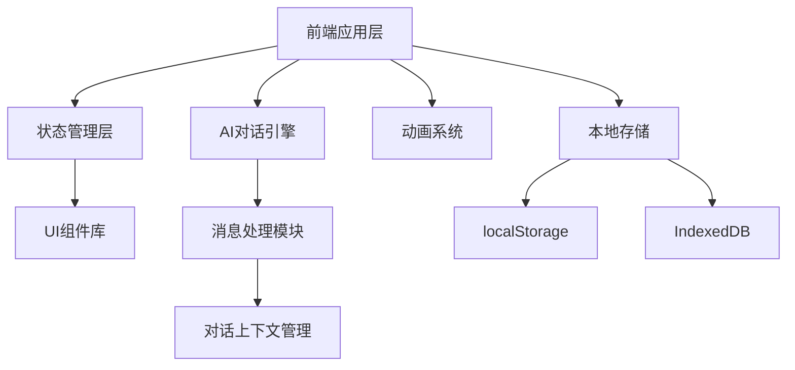

# AI智能伴侣 - 技术架构文档

## 1. 技术架构设计

### 1.1 整体架构



### 1.2 技术栈选择

**前端框架：**
- React@18（组件化开发）
- Vite（快速构建工具）
- TailwindCSS@3（原子化CSS框架）

**动画与交互：**
- Framer Motion（React动画库）
- CSS动画（基础动效）
- 原生CSS过渡

**状态管理：**
- React Context API（全局状态）
- useReducer（复杂状态逻辑）

**数据存储：**
- localStorage（用户偏好设置）
- IndexedDB（聊天记录存储）
- 会话级内存存储

---

## 2. 路由定义

### 2.1 页面路由

| 路由路径 | 页面名称 | 功能描述 |
|---------|---------|---------|
| `/` | 首页 | 主交互界面（默认进入） |
| `/settings` | 设置页 | 个性化配置 |
| `/history` | 历史记录 | 聊天历史浏览 |

### 2.2 应用结构

```
/                    # 主界面（AI形象 + 聊天）
├── AI形象展示区
├── 消息区域
├── 输入控制区
└── 模式切换

/settings            # 设置页面
├── 基础设置
├── 模式偏好
└── 隐私设置
```

---

## 3. 核心模块设计

### 3.1 状态管理架构

```typescript
// 全局状态类型
interface AppState {
  mode: 'assistant' | 'girlfriend';
  messages: Message[];
  userName: string;
  aiName: string;
  theme: 'light' | 'dark';
  isTyping: boolean;
}

interface Message {
  id: string;
  content: string;
  sender: 'user' | 'ai';
  timestamp: number;
  mode?: 'assistant' | 'girlfriend';
}
```

### 3.2 核心组件

| 组件名称 | 职责 | 依赖关系 |
|---------|------|---------|
| `App` | 根组件，状态提供者 | - |
| `ChatInterface` | 主聊天界面 | MessageList, InputArea |
| `AIAvatar` | AI形象展示 | ModeContext |
| `MessageBubble` | 消息气泡 | - |
| `ModeSwitcher` | 模式切换控制器 | ModeContext |
| `SettingsPanel` | 设置面板 | - |

### 3.3 模式切换机制

```typescript
// 模式切换流程
const switchMode = (newMode: 'assistant' | 'girlfriend') => {
  // 1. 触发切换动画
  setIsTransitioning(true);
  
  // 2. 延迟状态更新，等待动画完成
  setTimeout(() => {
    setMode(newMode);
    setIsTransitioning(false);
  }, 1500);
  
  // 3. 保存模式偏好
  localStorage.setItem('preferredMode', newMode);
};
```

---

## 4. AI对话系统设计

### 4.1 模拟对话引擎

由于是前端演示项目，采用模拟AI响应系统：

```typescript
// 对话响应系统
const generateAIResponse = async (userMessage: string, mode: Mode) => {
  // 模拟打字延迟
  await delay(1000 + Math.random() * 2000);
  
  // 根据模式返回不同风格的响应
  if (mode === 'assistant') {
    return getAssistantResponse(userMessage);
  } else {
    return getGirlfriendResponse(userMessage);
  }
};
```

### 4.2 模式响应策略

#### 助理模式响应
- 关键词识别：工作、任务、会议、文档
- 响应风格：专业、简洁、实用
- 示例响应库：10+ 个预设回复

#### 女友模式响应
- 关键词识别：吃饭、休息、心情、关心
- 响应风格：温暖、撒娇、关心、俏皮
- 示例响应库：15+ 个预设回复

---

## 5. 动画系统架构

### 5.1 动画类型

| 动画名称 | 触发时机 | 实现方式 |
|---------|---------|---------|
| 页面加载动画 | 首次渲染 | Framer Motion stagger |
| 消息发送动画 | 发送消息 | CSS transform + opacity |
| 模式切换动画 | 切换模式 | Framer Motion layout |
| 打字指示器 | AI正在输入 | CSS keyframes |
| 头像呼吸动画 | 持续播放 | CSS animation infinite |

### 5.2 性能优化

- 使用 `will-change` 优化动画性能
- 复杂动画使用 `transform` 而非位置属性
- 动画时长控制在 300ms 以内（交互类）
- 模式切换等特殊动画可延长至 1.5s

---

## 6. 数据持久化

### 6.1 localStorage 存储项

```typescript
interface StorageSchema {
  userName: string;        // 用户昵称
  aiName: string;          // AI称呼
  preferredMode: Mode;     // 偏好模式
  theme: 'light' | 'dark'; // 主题
  settings: object;        // 其他设置
}
```

### 6.2 IndexedDB 存储

```typescript
// 聊天记录数据库
interface ChatDB {
  messages: {
    id: string;
    content: string;
    sender: 'user' | 'ai';
    timestamp: number;
    mode: Mode;
  }[];
}
```

---

## 7. 项目文件结构

```
/workspace
├── index.html
├── package.json
├── vite.config.js
├── tailwind.config.js
├── postcss.config.js
├── src/
│   ├── main.jsx              # 入口文件
│   ├── App.jsx                # 根组件
│   ├── index.css              # 全局样式
│   ├── components/
│   │   ├── ChatInterface.jsx  # 聊天界面
│   │   ├── AIAvatar.jsx      # AI形象
│   │   ├── MessageList.jsx   # 消息列表
│   │   ├── MessageBubble.jsx # 消息气泡
│   │   ├── InputArea.jsx     # 输入区域
│   │   ├── ModeSwitcher.jsx  # 模式切换
│   │   ├── Settings.jsx      # 设置面板
│   │   └── TypingIndicator.jsx # 打字指示器
│   ├── contexts/
│   │   └── ModeContext.jsx   # 模式状态管理
│   ├── hooks/
│   │   ├── useMessages.js    # 消息管理
│   │   └── useStorage.js     # 本地存储
│   ├── utils/
│   │   ├── aiResponses.js    # AI响应生成
│   │   └── storage.js        # 存储工具
│   └── data/
│       └── responses.js      # 预设响应数据
```

---

## 8. 部署架构

**构建工具：** Vite
**输出目录：** `dist/`
**部署方式：** 静态文件部署（支持任意静态服务器）

**开发环境：**
- Node.js 18+
- npm / yarn
- Vite dev server

**生产构建：**
```bash
npm run build  # 生成 dist/ 目录
```
